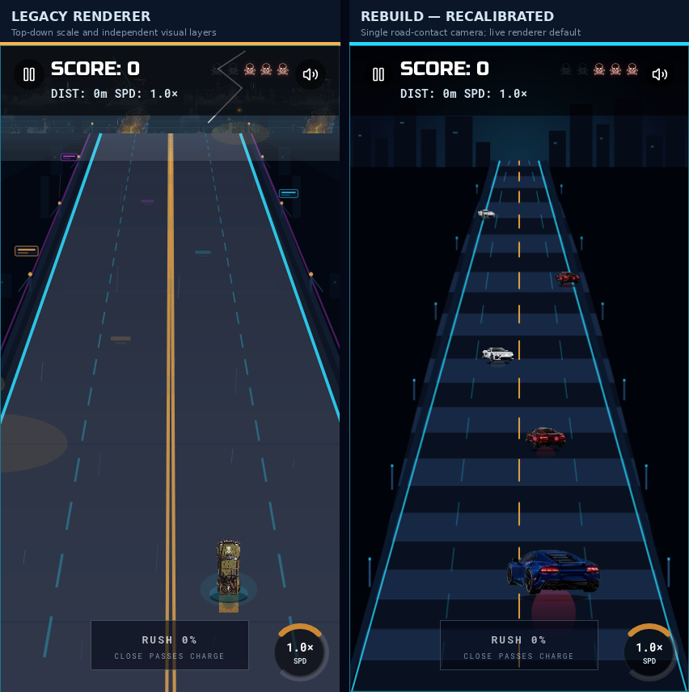
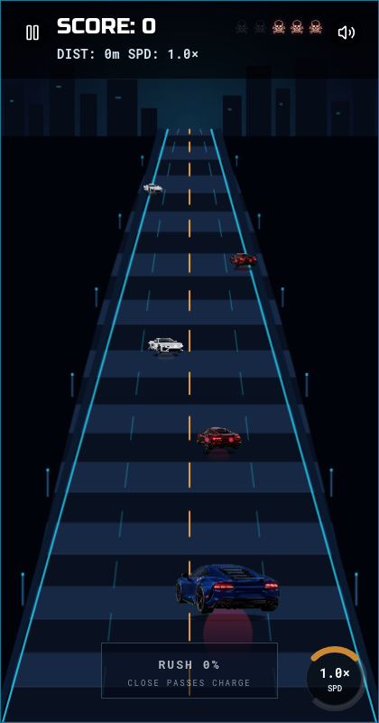
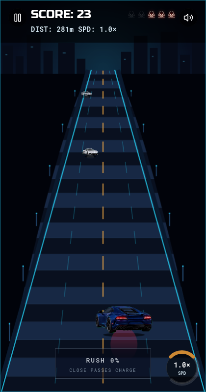

# Renderer Rebuild Grounding Proof Audit

**Date:** 2026-08-27  
**Branch:** `refactor/renderer-rebuild`  
**Author:** Manus AI  
**Status:** Scale recalibrated and enabled for real web gameplay motion; native parity and atmosphere remain gated

## Scope and decision

This audit records the first implementation slice of the approved renderer rebuild and its scale-calibration follow-up. The branch promotes the new Canvas 2D rear-chase renderer to its **web default**, while retaining the former Pixi scene at `?renderer=pixi` and the original Canvas fallback at `?renderer=canvas2d`. The isolated `?renderer=rebuild&demo=grounding` route remains available to freeze the initial `GameEngine` state for an exact proof capture. The shared simulation and native React Native Skia renderer are unchanged; neither legacy renderer has been deleted.

The rewrite responds to a demonstrated visual failure in the earlier elevated-deck implementation: road geometry, vehicle sprites, shadows, and effects applied related but separate position rules. This created visible disagreement about where a vehicle touched the road. The proof slice gives every rendered vehicle one `GroundPose` generated by a pure `buildRebuildFrame()` module. The road width, road row, vehicle scale, tire contact row, contact shadow, and wet-road reflection are all derived from that same pose.

## Implemented architecture

| Component | Responsibility | Present in proof |
| --- | --- | --- |
| `rebuild-frame.ts` | Pure screen-space ground/contact poses from immutable `GameState`; no gameplay mutation. | Yes |
| `rebuild-renderer.ts` | Stable Canvas 2D chase-camera scene, road, skyline, rails, vehicle layering, shadows, and reflections. | Yes |
| `Game.tsx` | Selects the rebuild renderer by default; `renderer=pixi` and `renderer=canvas2d` retain rollback routes; `demo=grounding` freezes the initial engine state for a reproducible proof frame. | Yes |
| Compact vehicle textures | Three keyed RGBA rear/front chase vehicle textures; source masters remain ignored. | Yes |
| Legacy Pixi scene and native Skia scene | Existing production/rollback renderers. | Retained, unmodified by this proof |

The implementation has no changes to `lib/game-core`, movement, collision geometry, spawn rules, score, Rush, control handling, audio, or backend state. Normal gameplay continues to start the shared engine. Only the explicit `demo=grounding` route omits `engine.start()` so a screenshot cannot be replaced by a collision/game-over state before review.

## Evidence

The captures below were obtained from the isolated browser at the exact 420×800 viewport. The static `demo=grounding` proof holds `SCORE`, `DIST`, and speed at their initial values by design; the separate moving capture uses the normal default route and advances real shared-engine state.

The comparison exposed that the initial rebuild player width was too dominant relative to a near-field lane. It was recalibrated from a 210–258px range to a selected-car-aware 118–142px range, and its contact row now derives from the same depth function as the road and rails. In the recorded frame, the player, same-direction traffic, and oncoming traffic all recede or enlarge along the same cyan-railed road corridor. The live capture reaches `SCORE: 23` and `DIST: 281m` without a game-over overlay, demonstrating real default-route state advancement rather than the frozen proof mode.

## Asset contract

The runtime proof uses three compact RGBA vehicle textures documented in [`docs/RENDERER_REBUILD_ASSETS.md`](../docs/RENDERER_REBUILD_ASSETS.md). Their high-resolution generated source art is intentionally ignored under `rebuild-assets/`; only the optimized web runtime textures are versioned. Assets carry no baked road, shadow, reflection, atmospheric layer, or text. Chroma-key conversion and alpha trimming remove source backdrops before runtime use.

## Validation record

| Check | Result | Evidence or limitation |
| --- | --- | --- |
| Frontend TypeScript | Passed | `pnpm --filter @workspace/warboss-highway run typecheck` |
| Full workspace TypeScript | Passed | `pnpm run typecheck` |
| Whitespace validation | Passed | `git diff --check` |
| Isolated 420×800 static proof and comparison | Passed | Matching legacy/rebuild capture; 0 browser console errors at route navigation/start. |
| Isolated 420×800 live renderer capture | Passed | Default route reaches `SCORE: 23`, `DIST: 281m` after 1.5 seconds, with 0 console errors. |
| Legacy Pixi and Canvas routes | Preserved by code path | Available at `renderer=pixi` and `renderer=canvas2d`; not re-profiled in this pass. |
| Physical iOS/Android runtime | Not run | No emulator or device profiler was available. |
| Hardware WebGL | Not evaluated | The rebuild renderer is Canvas 2D and is not a WebGL performance claim. |
| Native Skia renderer rebuild | Not started | Deferred pending stable web motion acceptance. |
| Remote CI/PR | Review pending | [PR #34](https://github.com/Thatisshayan/NightRacer/pull/34) contains the initial proof; calibration and motion follow-up are pending commit/push. |

## Explicit exclusions

The rebuild has demonstrated only a short normal-motion capture; it does not certify high-speed behavior, performance, accessibility, dense traffic culling, or cross-platform parity. Rain, lightning, billboards, puddle fields, boss rendering, obstacles, pickups, screen-shake treatment, Rush visuals, native Skia parity, and TestFlight distribution remain excluded. None of these are represented as complete.

## Next approval gate

The owner approved continuation after requesting a corrected player scale, a side-by-side comparison, and real web gameplay motion. Those requirements are complete on the branch. The next bounded phase is to validate high-speed/dense-traffic motion and then apply the same pure visual-frame layout to a native Skia adapter. The legacy implementation remains available as rollback; no renderer will be deleted without explicit approval.
