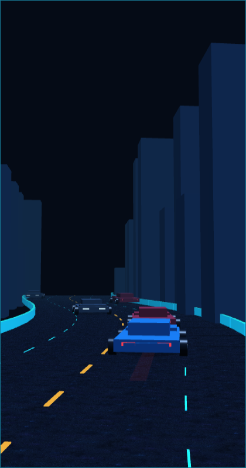

# Apex Storm Composition Proof Audit

**Date:** 2026-08-28
**Author:** Manus AI
**Branch:** `feat/apex-storm-renderer`
**Scope:** A narrow, opt-in, web-first deterministic composition proof for the approved **Apex Storm** rear-chase direction. This audit does not promote a new default renderer, modify the authoritative simulation, claim native parity, or authorize merge/release work.

## Audit basis

This audit evaluates the composition candidate against `docs/APEX_STORM_VISUAL_CONTRACT.md`, the repository’s governing rules, and the historical elevated-highway/vehicle-grounding audits. The previous Pixi, Canvas2D, and React Native Skia renderers remain present and unchanged as rollback paths. The rejected `refactor/renderer-rebuild` work was not used as the implementation base.

The proof is intentionally renderer-only. `lib/game-core` remains the owner of lanes, collision, controls, scoring, Rush, progression, and timing. The new `apex-storm-frame.ts` converts its immutable `GameState` into a deterministic curved-road frame; the isolated Babylon adapter consumes that frame without writing simulation coordinates back to the engine.

| Prior record | Relevant historical limitation | Status in this narrow proof |
| --- | --- | --- |
| `2026-08-27_Manus_ElevatedHighway_Audit.md` | Elevated-road work retained a diagrammatic flat-projection presentation. | **Superseded only for the opt-in Apex composition candidate.** Legacy presentation remains available and unchanged. |
| `2026-08-27_Manus_VehicleGroundingAtmosphere_Audit.md` | Earlier work corrected renderer-local contact but did not establish a real shallow three-dimensional chase scene. | **Narrowly advanced.** The Babylon proof derives tire plane, chassis lift, shadow, reflection, and traffic light placement from a single road-relative pose. |
| `docs/APEX_STORM_VISUAL_CONTRACT.md` | Requires a deterministic 420×800 curved wet-road frame before atmosphere, gameplay promotion, or native work. | **Implemented and captured. Owner visual acceptance remains pending.** |

## Implemented composition boundary

The browser route `?renderer=apex&demo=composition` keeps the new scene explicitly opt-in. The normal web route continues to choose the production Pixi renderer, while `?renderer=canvas2d` retains the fallback path. The special composition route does not start the shared engine’s RAF loop: it attaches the new renderer and sends exactly one initial `GameState` frame. A capture-only `autostart=1` query permits deterministic headless capture without modifying normal interaction.

| Area | Evidence in this proof | Boundary preserved |
| --- | --- | --- |
| Road geometry | Twenty-two fixed Babylon road segments follow one gently curved centreline, with asphalt texture, restrained amber/cyan guidance lines, and rail meshes. | Road coordinates are derived in the framework-independent frame builder; no gameplay lanes or collision values changed. |
| Vehicle contact | Each vehicle root stays on `y=0`; tires, tight disc shadow, thin wet reflection, chassis lift, and direction lamp placement share the same road-relative pose. | No screen-space vehicle/shadow offsets and no simulation-side camera data. |
| Camera | A fixed low rear-chase Babylon camera frames the player in the lower usable portrait field and follows the forward road path. | The camera exists only in the web adapter. |
| Traffic | The deterministic formation includes one far, one middle, and two near traffic placements, with red same-direction lamps and cool-white oncoming lamps. | Demo formation is query-gated and does not alter production spawning. |
| Environment | Sparse low-frequency buildings and the open void sit outside the driving corridor; no rain, lightning, animated signs, tunnels, or boss-event art were introduced. | Neon Tunnel Run and Skyline Siege remain deferred visual directions. |
| User interface | HUD, mute, and pause chrome are hidden only for the static composition proof so the world can be judged on its own. | Normal gameplay controls and HUD remain unchanged outside this query-gated route. |

## Visual evidence and checklist assessment

The preserved frame is a **candidate for owner review**, not a claim that the owner has already accepted the visual direction. It visibly demonstrates the minimum proof components: a textured rain-wet road, a one-path gentle curve, low-frequency city masses, red/white traffic direction lights, and a blue player vehicle with discernible side tire silhouettes and a compact red wet-surface streak.

| Visual-contract criterion | Evidence in `2026-08-28_Manus_ApexStormComposition_Proof.png` | Audit status |
| --- | --- | --- |
| Planted vehicles | Player and near traffic show grounded tire silhouettes against the same asphalt plane; body, shadow, reflection, and lamps are co-located from one pose. | **Candidate visible; owner review required.** |
| Broad, wet, curved elevated road | Asphalt texture, converging edge rails, spaced reflectors, and a single leftward curve establish a road plane rather than an independent lane layer. | **Candidate visible; owner review required.** |
| Sparse near/middle/far traffic | Four deterministic traffic vehicles form distinct depth bands; rear lamps are red and oncoming lamps are cool white. | **Candidate visible; owner review required.** |
| Restrained player scale | The player remains contained by its near-field road context and sits in the lower portrait driving band rather than filling the frame. | **Candidate visible; owner review required.** |
| One coherent camera | Barriers, skyline, road markings, contact shadow, and compact reflection share the same camera projection. | **Candidate visible; owner review required.** |
| No effect/HUD crutch | The proof capture contains no HUD, rain, lightning, blur, fog layer, billboard animation, tunnel treatment, or event treatment. | **Verified.** |

## Verification evidence

| Check | Command or route | Result |
| --- | --- | --- |
| Pure visual-frame invariants | `pnpm --filter @workspace/scripts test:apex-frame` | **Passed.** Confirmed deterministic output, fixed road segment count, demo formation count, depth sort, wheel-plane contact, road corridor bounds, and player shadow/reflection alignment. |
| Script workspace type safety | `pnpm --filter @workspace/scripts run typecheck` | **Passed.** |
| Web workspace type safety | `pnpm --filter @workspace/warboss-highway run typecheck` | **Passed.** |
| Repository type safety | `pnpm run typecheck` | **Passed across all repository workspaces.** |
| Required repository gate | `bash scripts/verify.sh` | **Passed.** Secret scan, documentation freshness, build/test, and directive lint passed. The local Vercel dry-run was explicitly skipped because `VERCEL_TOKEN` is unavailable in this environment. |
| Whitespace integrity | `git diff --check` | **Passed.** |
| Deterministic composition capture | `http://127.0.0.1:5175/?renderer=apex&demo=composition&autostart=1`, Chromium 420×800 with trusted-content SwiftShader software WebGL | **Captured.** Permanent evidence is `audits/2026-08-28_Manus_ApexStormComposition_Proof.png`. |
| Isolated-browser attach diagnostic | `?renderer=apex&demo=composition` in the Playwright isolated Firefox environment | **Blocked by environment capability:** Babylon reported `WebGL not supported` during `Engine` creation. This confirmed an isolated-browser limitation, not a scene-construction error. |
| Hardware/device validation | Physical iOS/Android device, hardware WebGL, GPU profiler | **Not performed.** No physical device or hardware-GPU capture was available. |

## Residual risk and deferred work

The candidate frame was captured through software WebGL, which verifies that the Babylon scene initializes and renders in a software rasterization path. It is not evidence of hardware-WebGL fidelity, real-device performance, mobile rendering parity, or actual gameplay motion. The isolated Firefox automation environment cannot create WebGL for this route, so it cannot serve as a Babylon visual-validation surface.

Per the approved contract, this branch stops at the static composition proof. Real gameplay motion and dense-traffic testing, rain/lightning/reflections, Neon Tunnel Run district richness, Skyline Siege events, native Skia adaptation, physical-device profiling, default-route promotion, merge, iOS archive, and TestFlight submission remain explicitly deferred pending the owner’s image review.

## Changed files

| File | Change |
| --- | --- |
| `docs/APEX_STORM_VISUAL_CONTRACT.md` | Approved source of truth for camera/contact/light hierarchy and proof acceptance. |
| `artifacts/warboss-highway/src/lib/game/apex-storm-frame.ts` | Pure deterministic curved-road and unified vehicle-pose builder. |
| `scripts/src/check-apex-storm-frame.ts` | Executable invariant check for the pure composition frame. |
| `artifacts/warboss-highway/src/lib/game/apex-storm-renderer.ts` | Isolated Babylon web adapter with fixed road/city/vehicle pools and a low rear-chase camera. |
| `artifacts/warboss-highway/src/pages/Game.tsx` | Opt-in Apex routing plus query-gated deterministic static composition capture; legacy routes remain default/fallback. |
| `artifacts/warboss-highway/public/apex/wet-asphalt-tile.jpg` | Compact 512×512 runtime wet-asphalt material. |
| `audits/2026-08-28_Manus_ApexStormComposition_Proof.png` | Preserved 420×800 composition-candidate screenshot. |
| `audits/2026-08-28_Manus_ApexStormComposition_Audit.md` | This audit and evidence record. |

**Conclusion:** The feature branch now contains a deterministic, opt-in, web-first Apex Storm composition candidate with a real three-dimensional road and road-relative vehicle-contact treatment. It is deliberately held at the visual-review gate. No default change, merge, mobile claim, or release/TestFlight action is warranted until Shayan accepts this proof image.
